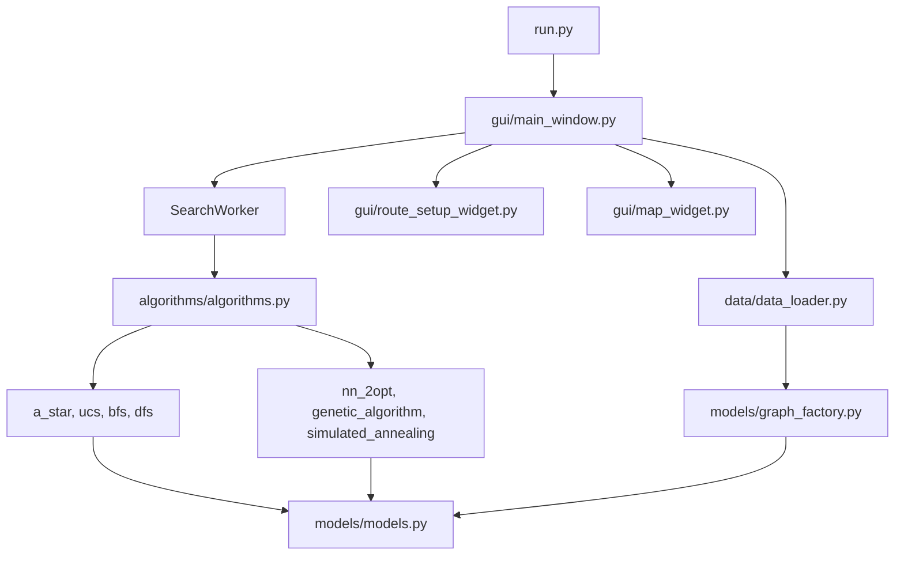
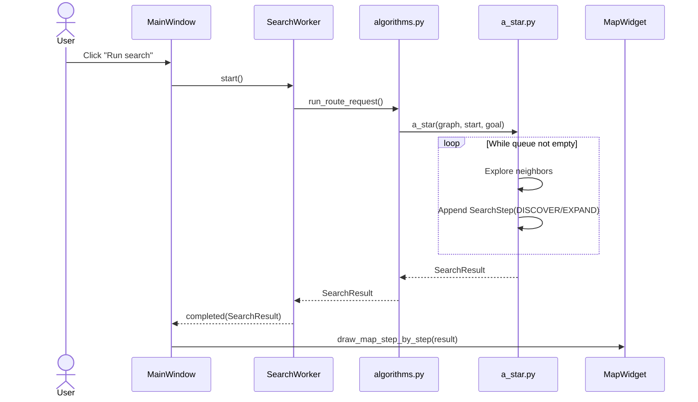

# Project Codebase Map

Ứng dụng **Route Optimization Visualizer** là một hệ thống desktop dựa trên PyQt5, được thiết kế để trực quan hóa cách hoạt động của các thuật toán tìm đường trên đồ thị giao thông thực tế. Kiến trúc của project tuân theo mô hình phân tách trách nhiệm rõ ràng:

```text
User
  ↓
GUI (PyQt5) -> (main_window.py, map_widget.py, route_setup_widget.py)
  ↓
Worker Thread (SearchWorker)
  ↓
Algorithm Registry (algorithms.py)
  ↓
Algorithms (A*, BFS, DFS, SA, GA, NN+2Opt,...)
  ↓
Graph Data Model (models.py, graph_factory.py)
  ↓
SearchResult / SearchSteps
  ↓
Main Thread (MainWindow._on_search_completed)
  ↓
Visualization (map_widget.py)
  ↓
User View
```

Hệ thống hỗ trợ 2 chế độ (Route Modes) chính:
- **Single-route search:** Tìm đường giữa 1 điểm Start và 1 điểm Goal (sử dụng BFS, DFS, UCS, A*, Bidirectional Search, Beam Search).
- **Multi-location search:** Tìm đường tối ưu qua nhiều điểm Goal (có thể quay về Start) (sử dụng Simulated Annealing, Genetic Algorithm, Nearest Neighbor + 2-Opt).

---

# Recommended Reading Order

Để hiểu toàn bộ codebase từ đầu đến cuối, hãy đọc các file theo thứ tự sau:

1. **`run.py`**
   - Entry point cực kỳ đơn giản. Nó import và gọi hàm `main()` từ `src/gui/main_window.py`.
2. **`src/models/models.py`**
   - Đọc các class `Node`, `Edge`, `Graph` để hiểu cấu trúc đồ thị cơ bản.
   - Đọc `RouteRequest` (Input) và `SearchResult`, `SearchStep` (Output) để hiểu contract dữ liệu giữa thuật toán và GUI.
3. **`src/data/data_loader.py` & `src/models/graph_factory.py`**
   - Đọc `load_dataset(...)` và `build_graph(...)` để hiểu cách dữ liệu JSON được parse thành object `Graph`, cũng như cách tính `weight` của `Edge`.
4. **`src/gui/main_window.py`**
   - Đọc hàm `__init__`, `build_ui`, và `connect_signals` của class `MainWindow`.
   - Đặc biệt đọc flow của `on_run_search_clicked()` và cách nó khởi tạo `SearchWorker`.
5. **`src/algorithms/algorithms.py`**
   - Xem cách các thuật toán được đăng ký (registry) qua các dictionary `ALGORITHMS` và `MULTI_LOCATION_ALGORITHMS`.
   - Đọc hàm `run_route_request(...)` để hiểu thuật toán nào được gọi.
6. **`src/algorithms/a_star.py`**
   - Đọc function `a_star(graph, start_id, goal_id)`. Đây là ví dụ tiêu chuẩn nhất cho Single-route. Xem cách nó emit `SearchStep(StepType.DISCOVER/EXPAND/FINISH)`.
7. **`src/algorithms/nearest_neighbor_2opt.py`**
   - Đọc function `nearest_neighbor_2opt(...)` để hiểu sự khác biệt của Multi-location algorithms: cách nó lấy shortest-path matric (Dijkstra metric closure), optimize route, và trả về full path.
8. **`src/gui/map_widget.py`**
   - Đọc `draw_map_step_by_step(...)` và `_dispatch_steps(...)` để hiểu cách GUI phân giải các `SearchStep` từ algorithm và vẽ lên UI bằng cách truyền qua Javascript (nếu dùng WebEngine) hoặc QPainter.

---

# File-by-File Guide

## `src/models/models.py`

### Purpose
Chứa tất cả các Data Models cốt lõi của project. File này định nghĩa các thực thể tĩnh và object được luân chuyển giữa các layer.

### Important Classes

#### `Graph`
- **Vai trò:** Cấu trúc dữ liệu chính lưu trữ đỉnh và cạnh.
- **Thuộc tính quan trọng:** `nodes` (dict), `adjacency_list` (dict của Node ID ra các Edge hướng đi), `incoming_adjacency_list`.
- **Được tạo ở đâu:** `graph_factory.py` -> `build_graph()`.
- **Được sử dụng ở đâu:** Hầu hết mọi nơi (Algorithms, GUI, Workers).

#### `SearchStep`
- **Vai trò:** Đại diện cho 1 sự kiện tìm kiếm duy nhất, dùng để làm visualization / playback.
- **Thuộc tính quan trọng:** `step_type` (DISCOVER, EXPAND, UPDATE, FINISH), `node_id`, `metrics`, `frontier`.
- **Được tạo ở đâu:** Bên trong vòng lặp của các algorithms (`a_star.py`, `bfs.py`, v.v.).
- **Được sử dụng ở đâu:** Trả về trong mảng `steps` của `SearchResult`, truyền qua `map_widget.py`.

#### `SearchResult`
- **Vai trò:** Object chuẩn hóa kết quả cuối cùng từ một search algorithm.
- **Thuộc tính quan trọng:** `path` (list of nodes), `steps` (list of `SearchStep`), `total_cost`, `success`.

## `src/models/graph_factory.py`

### Purpose
Dùng Factory Pattern để khởi tạo `Graph` object từ các file data thô.

### Important Functions

#### `build_graph(json_path: str) -> Graph`
**Purpose**: Khởi tạo `Graph` từ file dataset.
**Input**:
```text
json_path: Đường dẫn file JSON chứa dữ liệu đỉnh và cạnh.
```
**Output**: Object `Graph` hoàn chỉnh.
**Called by**: `src/data/data_loader.py -> load_dataset()`.
**Internal Flow**:
1. Đọc file JSON.
2. Lặp qua danh sách node, khởi tạo `Node`, gọi `graph.add_node()`.
3. Lặp qua danh sách edge, tính distance, tính default speed (nếu không có time), tính weight.
4. Normalize value và gắn vào `Edge`, gọi `graph.add_edge()`.
**Why this function matters**: Khởi tạo cấu trúc data đúng chuẩn để chạy thuật toán.

## `src/gui/main_window.py`

### Purpose
Là controller trung tâm của toàn bộ ứng dụng, khởi tạo UI, quản lý State, và bridge giữa UI (user actions) và Backend (Worker).

### Important Classes

#### `MainWindow`
- **Vai trò:** Widget gốc chứa toàn bộ giao diện và luồng xử lý ứng dụng.

#### `SearchWorker(QObject)`
- **Vai trò:** Chạy các thuật toán Graph trên một thread riêng (QThread) để tránh block UI thread.
- **Được tạo ở đâu:** Bên trong `MainWindow.on_run_search_clicked()`.
- **Được sử dụng ở đâu:** Gắn vào `QThread` trong MainWindow.

### Important Functions

#### `on_run_search_clicked(...)`
**Purpose**: Xử lý event khi user nhấn nút "Run search".
**Input**: Tham số lấy từ UI: `start_id`, `goals`, `algorithm`.
**Output**: Không có (void). Khởi tạo thread mới.
**Calls**:
- `self.route_request()`
- Khởi tạo `SearchWorker`
- Khởi tạo `QThread`
- `worker.run()`
**Why this function matters**: Khởi chạy toàn bộ quá trình xử lý của app.

#### `_on_search_completed(result, runtime_ms)`
**Purpose**: Callback khi `SearchWorker` hoàn thành, cập nhật kết quả lên UI.
**Input**: `result` (object `SearchResult`), `runtime_ms`.
**Called by**: `SearchWorker.completed` signal.
**Calls**:
- `self.map_widget.draw_map_step_by_step(...)` để kích hoạt visualize.
- Cập nhật các Info Tabs.
**Why this function matters**: Đưa dữ liệu kết quả từ Backend quay lại Frontend.

## `src/algorithms/a_star.py`

### Purpose
Cài đặt thuật toán tìm đường A* chuẩn.

### Important Functions

#### `a_star(graph, start_id, goal_id)`
**Purpose**: Tìm đường tối ưu từ Start đến Goal.
**Input**:
```text
graph: Đồ thị.
start_id: Node bắt đầu.
goal_id: Node đích.
```
**Output**: Object `SearchResult`.
**Called by**: `algorithms.py -> run_algorithm()`.
**Calls**:
- `graph.get_neighbors()`
- `edge.calculate_cost()`
- `geographic_heuristic()`
**Internal Flow**:
1. Khởi tạo `open_set` (Priority queue).
2. Lặp chừng nào queue còn dữ liệu: pop node có `f` nhỏ nhất.
3. Emit `SearchStep(EXPAND)`.
4. Check nếu là `goal_id` -> build `path` bằng cách lùi về theo `came_from` -> emit `FINISH` -> return `SearchResult`.
5. Nếu chưa đến goal, duyệt neighbors, tính `tentative_g` = cost hiện tại + cost cạnh.
6. Nếu tìm thấy đường tốt hơn -> push vào queue, cập nhật `g_score`.
7. Emit `SearchStep(DISCOVER)` cho các neighbor.
**Why this function matters**: Template tiêu chuẩn minh họa các luồng Algorithm-Visualization hoạt động trong project.

---

# Function Call Chains

Chuỗi gọi hàm khi User thực hiện chạy một Route Search chuẩn:

```text
src/gui/main_window.py
MainWindow.on_run_search_clicked()
        ↓
MainWindow._search_worker = SearchWorker(...)
MainWindow._search_thread.start()
        ↓ (via Thread signal)
SearchWorker.run()
        ↓
src/algorithms/algorithms.py
run_route_request(...)
        ↓ (if single mode)
run_algorithm(name, graph, start, goal)
        ↓
src/algorithms/a_star.py (example)
a_star(graph, start, goal)
        ↓
(Loop over graph, use PriorityQueue, calculate costs)
        ↓
src/models/models.py
Graph.get_neighbors()
Edge.calculate_cost()
        ↓
(Algorithm builds steps array)
        ↓
return SearchResult(path, steps, total_cost, ...)
        ↓
SearchWorker.run() (completes)
        ↓ (via completed Signal)
src/gui/main_window.py
MainWindow._on_search_completed(result, runtime_ms)
        ↓
src/gui/map_widget.py
map_widget.draw_map_step_by_step(...)
        ↓
GUI Visualization update
```

---

# End-to-End Program Flows

## Flow 1 — App Initialization & Graph Loading

```text
User clicks Load
    ↓
gui/main_window.py
MainWindow.on_load_graph_clicked()
    ↓
data/data_loader.py
load_dataset(filename)
    ↓
models/graph_factory.py
build_graph(json_path)
    ↓
models/models.py
Graph, Node, Edge created
    ↓
gui/main_window.py
MainWindow._finish_visualization_load()
    ↓
gui/map_widget.py
Map updated
```
**Giải thích**: Mở dataset từ file JSON, parse bằng `graph_factory`, chuẩn hóa khoảng cách và tính trọng số, trả về object Graph cho MapWidget vẽ.

## Flow 2 — User runs a Single-Route Search

```text
User clicks Run
    ↓
gui/main_window.py
MainWindow.on_run_search_clicked()
    ↓
workers/search_worker (inside main_window.py)
SearchWorker.run()
    ↓
algorithms/algorithms.py
run_route_request()
    ↓
algorithms/a_star.py
a_star()
    ↓
models/models.py
SearchResult (contains steps)
    ↓
gui/main_window.py
MainWindow._on_search_completed()
    ↓
gui/map_widget.py
draw_map_step_by_step()
```
**Giải thích**: Worker chạy thuật toán A* trong Thread chạy ngầm. Quá trình chạy phát sinh event (SearchStep), gộp thành SearchResult. Sau khi xong, tín hiệu trả về MainWindow và phát cho Timer vẽ.

---

# Data Flow

Dữ liệu di chuyển xuyên suốt hệ thống như sau:

```text
GUI (RouteSetupWidget):
start_id = "node_1"
goal_ids = ["node_5"]

        ↓ (RouteRequest object)

SearchWorker:
algorithm = "A* Search"
graph = <Graph object>

        ↓

A*:
Khởi tạo: open_set = [(heuristic, 0.0, "node_1")]
Loop: neighbor_cost = edge.calculate_cost()
Tạo các SearchStep(type=DISCOVER, node_id="...")

        ↓

SearchResult:
{
    success: True,
    total_cost: 12.5,
    path: ["node_1", "node_2", "node_5"],
    steps: [SearchStep(...), SearchStep(...), ...],
    ...
}

        ↓

MainWindow:
Nhận SearchResult, truyền cho MapWidget

        ↓

MapWidget (Timer):
Phân rã steps -> highlight từng edge màu cam (Frontier) -> xanh (Path).
```

---

# Algorithm Integration

Quy trình một Algorithm mới được gọi vào hệ thống:

```text
GUI chọn algorithm ở dropdown "Search strategy"
        ↓
Tên value (VD: "A* Search") được lấy ra.
        ↓
MainWindow tạo SearchWorker(algorithm_name)
        ↓
Worker gọi run_route_request(name)
        ↓
Hàm check trong dictionary ALGORITHMS[name]
        ↓
Gọi reference function tương ứng.
```

| Algorithm | File | Entry Function/Class | Input | Output | Called From |
| --------- | ---- | -------------------- | ----- | ------ | ----------- |
| DFS | `algorithms/dfs.py` | `dfs(...)` | graph, start, goal | SearchResult | `algorithms.py` |
| BFS | `algorithms/bfs.py` | `bfs(...)` | graph, start, goal | SearchResult | `algorithms.py` |
| UCS | `algorithms/ucs.py` | `ucs(...)` | graph, start, goal | SearchResult | `algorithms.py` |
| A* Search | `algorithms/a_star.py` | `a_star(...)` | graph, start, goal | SearchResult | `algorithms.py` |
| Genetic Alg. | `algorithms/genetic_algorithm.py` | `genetic_algorithm(...)` | graph, start, goals, ... | SearchResult | `algorithms.py` |
| NN + 2-Opt | `algorithms/nearest_neighbor_2opt.py` | `nearest_neighbor_2opt(...)` | graph, start, goals, ... | SearchResult | `algorithms.py` |

---

# Graph and Data Model

```text
Graph
 ├── Nodes
 │    └── Node (id, lat, lon)
 │
 ├── adjacency_list (dict)
 │    └── Node ID -> [Edge, Edge, ...]
 │
 └── incoming_adjacency_list (dict)
      └── Node ID -> [Edge, Edge, ...]
```

- **Graph được tạo khi nào?** Khi user click nút "Load graph data", thông qua `build_graph()` trong `graph_factory.py`.
- **Data được load từ đâu?** Từ thư mục `data/*.json`.
- **Node/Edge được lưu thế nào?** Lưu thành list/dictionary trong RAM. Cạnh hướng lưu trong `adjacency_list` để lấy neighbors (`graph.get_neighbors(node_id)`).
- **Normalized fields được tạo ở đâu?** Trong `graph_factory.py` bằng việc duyệt lần 2, lấy `distance / max_distance`.
- **Cost được tính bằng function nào?** `Edge.calculate_cost()`.
- Biểu thức Weight: `(alpha * norm_distance) + (beta * norm_travel_time) + (gamma * congestion) + (delta * risk)`.

---

# GUI Event Flow

| User Action | GUI Handler | Next Function | Backend Component |
| ----------- | ----------- | ------------- | ----------------- |
| Select dataset | `dataset_combo` | N/A | Dữ liệu nội bộ |
| Click "Load graph data" | `on_load_graph_clicked` | `load_dataset` | `GraphFactory` |
| Set Start / Add Goal | `on_route_selection_changed` | `_update_route_context` | UI config updates |
| Click "Run search" | `on_run_search_clicked` | `SearchWorker.run()` | `algorithms.py` |
| Click "Pause" | `on_pause_resume_clicked` | `pause_animation()` | `MapWidget` Timer dừng |
| Click "Next" | `on_next_clicked` | `next_step()` | `MapWidget` step tay |

---

# Search Visualization Flow

Quá trình "Playback" lại quá trình tìm kiếm như sau:

```text
Algorithm (e.g., A*)
↓ (Emit SearchStep objects for each logic step)
steps list trong SearchResult
↓
MainWindow
↓
map_widget.draw_map_step_by_step(result, interval)
↓
QTimer (_timer) trigger tick
↓
_dispatch_steps()
↓
Javascript Bridge / Qt Painter
```

- **Khi nào một step được tạo?** Bên trong thuật toán (ví dụ: đưa vào PriorityQueue -> DISCOVER, pop ra -> EXPAND).
- **Autoplay hoạt động thế nào?** Dùng `QTimer`, mỗi tick gọi update hiển thị các item `SearchStep` theo index. Tốc độ điều chỉnh bằng interval time (ms).
- **Map Update:** `MapWidget._bounded_playback_end` hoặc timer tick sẽ thay đổi màu / render path.

---

# Multi-Location Routing Flow

Đây là luồng dành cho việc giao hàng nhiều điểm:

```text
User chọn Start + 3 Delivery Goals
↓
Route mode được nhận diện là "multi" (gui/main_window.py)
↓
algorithms/nearest_neighbor_2opt.py
nearest_neighbor_2opt()
↓
_shortest_routes_from() (Dijkstra) xây dựng Matrix Cost giữa (Start, G1, G2, G3)
↓
NN Algorithm nối Start -> điểm gần nhất -> điểm gần nhì ...
↓
2-Opt Algorithm lật chéo route để tối ưu hóa
↓
Kết quả là danh sách thứ tự Nodes đã được sắp xếp tốt nhất
↓
_construct_full_path() lấy các đường đi map thực tế nối kết lại
↓
SearchResult (path = [... real nodes...], goal_visit_order = [...])
↓
Visualization Render (Quy trình gom batch frame trong map_widget)
```

- **Điểm khác biệt lớn:** Multi-location algorithms **không trực tiếp dò từng Node đường phố**, mà chúng tạo ra Metric Closure Graph, giải TSP, sau đó ráp đường đi thực tế lại.

---

# Worker and Signal Flow

Hệ thống sử dụng Signal-Slot của Qt cực kỳ an toàn để giao tiếp thread:

```text
MainWindow
   │
   ├── Khởi tạo _search_thread (QThread)
   ├── Khởi tạo _search_worker (SearchWorker)
   │
   ├── worker.moveToThread(thread)
   ├── thread.started.connect(worker.run)
   ├── worker.completed.connect(self._on_search_completed)
   │
   └── thread.start()

(Trên Thread riêng) SearchWorker
   ↓
   Chạy Algorithm
   ↓
   emit completed(SearchResult, time)

(Trên Main Thread) MainWindow
   ↓
   _on_search_completed() (Nhận an toàn do event-loop Qt xử lý)
```

---

# Important Object Lifecycles

## `Graph`
```text
App starts (None)
↓
User clicks Load (build_graph in graph_factory)
↓
Stored in MainWindow.graph
↓
Passed to Worker/Algorithm (Read-only during search)
↓
Cleared and replaced if user loads another dataset.
```

## `SearchResult`
```text
Created inside Algorithm (e.g. at the end of A*)
↓
Wrapped with metadata by SearchWorker
↓
Passed to GUI via Signals
↓
Used by MapWidget for playback loop
↓
Stored as `MainWindow._active_result` for comparison functions.
```

---

# Module Dependency Map



---

# Sequence Diagram

Dưới đây là Sequence Diagram cho quá trình một user thực hiện chạy thuật toán A*:



---

# Follow the Code — Step by Step

Hãy thử nghiệm đọc code theo trình tự sau trong IDE của bạn:

### Step 1: Entry Point
Mở file `run.py`. Bạn sẽ thấy `from src.gui.main_window import main`.

### Step 2: Main Window
Mở `src/gui/main_window.py`. Tìm hàm `on_run_search_clicked()`.
Đọc cách nó tạo `SearchWorker` và sử dụng `QThread`.

### Step 3: Thread Worker
Cũng trong `main_window.py`, kéo lên trên cùng tìm `class SearchWorker(QObject)`.
Đọc hàm `run()`. Bạn sẽ thấy hàm `run_route_request(...)` được gọi.
Ctrl + Click vào `run_route_request`.

### Step 4: The Dispatcher
IDE mở `src/algorithms/algorithms.py`.
Đọc `run_route_request`, nó sẽ gọi `run_algorithm()`.

### Step 5: Core Algorithm
Mở file `src/algorithms/a_star.py`.
Khảo sát vòng lặp `while open_set:`.

### Step 6: Object Model
Ctrl+Click vào `SearchStep` sẽ dẫn tới `src/models/models.py`.
Kiểm tra cấu trúc tĩnh `Graph`, `Edge` và `SearchResult`.

### Step 7: GUI Playback
Quay lại hàm `_on_search_completed()` trong `MainWindow`.
Ctrl+Click vào lệnh `self.map_widget.draw_map_step_by_step(...)`.

---

# Where to Look When Something Breaks

| Problem | First File to Check | Function / Logic |
| ------- | ------------------- | ---------------- |
| **Không load được graph data** | `data_loader.py` & `graph_factory.py` | `build_graph()` kiểm tra parse data format bị thiếu. |
| **Nhấn Run không chạy / Đơ app** | `main_window.py` | Kiểm tra Thread khởi tạo đúng không. |
| **Algorithm tính sai Cost** | `models.py` | `Edge.calculate_cost()`. Coi chừng alpha/beta. |
| **Báo No Path Found** | `a_star.py` | Kiểm tra Graph có liên thông hay không, heuristic code. |
| **Multi-Location lỗi lộ trình** | `nearest_neighbor_2opt.py` | `_shortest_routes_from()` hoặc NN logic. |
| **GUI không hiển thị Animation** | `map_widget.py` | `draw_map_step_by_step`, coi interval time = 0. |

---

# Key Functions to Master

| Priority | File | Function/Class | Why Important |
| -------- | ---- | -------------- | ------------- |
| 1 | `main_window.py` | `on_run_search_clicked()` | Entry point cho tương tác chính. |
| 2 | `graph_factory.py` | `build_graph()` | Cách JSON parse thành Object Graph. |
| 3 | `models.py` | `Edge.calculate_cost()` | Hệ quy chiếu trọng số thuật toán. |
| 4 | `algorithms.py` | `run_route_request()` | Cách hệ thống Routing request phân cấp. |
| 5 | `a_star.py` | `a_star()` | Implementation tiêu biểu nhất cho Single-route. |
| 6 | `nearest_neighbor_2opt.py`| `two_opt()` | Logic TSP Optimizer tiêu biểu nhất. |
| 7 | `map_widget.py` | `_dispatch_steps()` | Động cơ render cốt lõi. |

---

# Quick Revision Map

```text
APP START
│
├── Load Data (Data Loader -> Graph Factory -> Models)
│
├── Initialize GUI (MainWindow)
│
├── User configures Route (RouteSetupWidget)
│
├── Run Algorithm (SearchWorker trên QThread)
│      ├── Single: Chạy Node-by-Node Search
│      └── Multi: Tính Dijkstra Closure -> Tối ưu lộ trình
│
├── Build SearchResult
│
└── Visualization (MapWidget push steps to JS/Painter)
```
