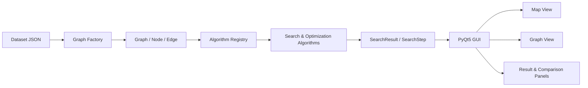

# HCMUS AI Route Optimization

Ứng dụng trực quan hóa và so sánh các thuật toán tìm đường trên mạng lưới giao thông Thành phố Hồ Chí Minh. Dự án được xây dựng bằng Python và PyQt5, hỗ trợ tìm đường giữa hai vị trí, tối ưu lộ trình qua nhiều điểm giao hàng, mô phỏng thuật toán từng bước và đo hiệu năng trên nhiều bộ dữ liệu.

## Mục lục

- [Tổng quan](#tổng-quan)
- [Tính năng chính](#tính-năng-chính)
- [Các thuật toán](#các-thuật-toán)
- [Mô hình chi phí](#mô-hình-chi-phí)
- [Kiến trúc dự án](#kiến-trúc-dự-án)
- [Yêu cầu hệ thống](#yêu-cầu-hệ-thống)
- [Cài đặt](#cài-đặt)
- [Chạy ứng dụng](#chạy-ứng-dụng)
- [Hướng dẫn sử dụng](#hướng-dẫn-sử-dụng)
- [Kiểm thử](#kiểm-thử)
- [Benchmark hiệu năng](#benchmark-hiệu-năng)
- [Dữ liệu](#dữ-liệu)
- [Cấu trúc thư mục](#cấu-trúc-thư-mục)
- [Giới hạn hiện tại](#giới-hạn-hiện-tại)
- [Giấy phép](#giấy-phép)

## Tổng quan

Dự án mô hình hóa mạng lưới giao thông dưới dạng đồ thị có trọng số:

- **Node** biểu diễn giao lộ hoặc vị trí trên bản đồ.
- **Edge** biểu diễn đoạn đường có hướng giữa hai node.
- Mỗi cạnh chứa thông tin khoảng cách, thời gian di chuyển, loại đường, mức ùn tắc và rủi ro.
- Thuật toán trả về `SearchResult`, bao gồm tuyến đường, tổng chi phí, thứ tự duyệt và các bước trực quan hóa.

Ứng dụng có hai chế độ:

1. **Single-route**: tìm đường từ một điểm bắt đầu đến một điểm đích.
2. **Multi-location**: tìm lộ trình qua từ hai điểm giao hàng trở lên, có thể giữ nguyên thứ tự điểm đến hoặc để thuật toán tối ưu thứ tự.

## Tính năng chính

- Hiển thị dữ liệu trên **Map View** sử dụng Leaflet và OpenStreetMap.
- Hiển thị cấu trúc mạng lưới trên **Graph View**.
- Tìm node theo ID hoặc tên giao lộ.
- Trực quan hóa `Current Node`, `Frontier`, `Explored` và các bước khám phá cạnh.
- Điều khiển phát lại: Instant, Fast, Balanced, Detailed hoặc Step by step.
- Pause, Resume, Previous, Next, Replay và Reset quá trình mô phỏng.
- So sánh tuyến đang chọn với thuật toán khác trên cùng yêu cầu đầu vào.
- Báo cáo số node đã duyệt, số cạnh, tổng chi phí, khoảng cách, thời gian ước lượng và runtime.
- Hỗ trợ nhiều điểm giao hàng, giữ thứ tự danh sách và quay lại điểm bắt đầu.
- Cho phép chỉnh thời gian, ùn tắc và rủi ro của cạnh trong phiên làm việc hiện tại.
- Hỗ trợ giao diện sáng và tối.

## Các thuật toán

### Tìm đường single-route

| Thuật toán | Chiến lược chính | Đặc điểm |
|---|---|---|
| Breadth-First Search (BFS) | Hàng đợi FIFO, duyệt theo lớp | Tìm tuyến ít cạnh nhất; không dùng trọng số để lựa chọn đường |
| Depth-First Search (DFS) | Đi sâu theo một nhánh trước | Đơn giản, không bảo đảm tuyến tối ưu |
| Uniform Cost Search (UCS) | Ưu tiên tổng chi phí `g` nhỏ nhất | Tối ưu với chi phí cạnh không âm |
| A* Search | Ưu tiên `f = g + h` | Kết hợp chi phí đã đi và heuristic Haversine |
| Bidirectional Search (UCS) | Tìm kiếm có trọng số từ hai phía | Giảm không gian tìm kiếm trong nhiều trường hợp |
| Beam Search | Chỉ giữ một số ứng viên tốt nhất | Tiết kiệm bộ nhớ nhưng không bảo đảm tối ưu |
| Genetic Algorithm (GA) | Tìm kiếm tiến hóa | Thuật toán ngẫu nhiên, phù hợp khảo sát nghiệm gần tối ưu |

### Tối ưu multi-location

| Thuật toán | Đặc điểm |
|---|---|
| Genetic Algorithm (GA) | Tối ưu thứ tự ghé thăm bằng quần thể, lai ghép và đột biến |
| Nearest Neighbor + 2-Opt | Tạo nghiệm tham lam, sau đó cải thiện bằng hoán đổi 2-Opt |
| Simulated Annealing (SA) | Chấp nhận có kiểm soát nghiệm xấu hơn để tránh cực trị cục bộ |

GA được đăng ký cho cả hai chế độ, vì vậy giao diện có 10 lựa chọn thuật toán nhưng tương ứng với 9 triển khai production khác nhau.

## Mô hình chi phí

Khoảng cách và thời gian của cạnh được chuẩn hóa theo giá trị lớn nhất trong đồ thị. Chi phí mặc định được tính như sau:

```text
cost(edge) = 0.25 × distance_norm
           + 0.45 × travel_time_norm
           + 0.20 × congestion
           + 0.10 × risk
```

Trong đó:

- `distance_norm`: khoảng cách đã chuẩn hóa.
- `travel_time_norm`: thời gian di chuyển đã chuẩn hóa.
- `congestion`: mức ùn tắc trong đoạn `[0, 1]`.
- `risk`: mức rủi ro trong đoạn `[0, 1]`.

BFS và DFS chỉ dùng chi phí để báo cáo sau khi có kết quả. UCS, A*, Bidirectional Search và các thuật toán tối ưu sử dụng chi phí trong quá trình lựa chọn tuyến.

Heuristic của A* sử dụng khoảng cách Haversine:

```text
h(node) = 0.25 × haversine(node, goal) / graph.max_distance
f(node) = g(node) + h(node)
```

## Kiến trúc dự án



Luồng xử lý chính:

1. `src/data/data_loader.py` tìm các dataset JSON trong thư mục `data/`.
2. `src/models/graph_factory.py` chuyển dữ liệu JSON thành `Graph`, `Node` và `Edge`.
3. `src/algorithms/algorithms.py` cung cấp registry và điều phối thuật toán theo chế độ tuyến.
4. Thuật toán sinh `SearchResult` và chuỗi `SearchStep`.
5. GUI phát lại từng bước trên bản đồ, graph và bảng trạng thái.
6. `src/algorithms/route_comparison.py` chuẩn hóa chỉ số để so sánh các kết quả.

## Yêu cầu hệ thống

- Python **3.10 trở lên**; Python 3.10 hoặc 3.11 được khuyến nghị.
- Windows, macOS hoặc Linux có môi trường desktop.
- Kết nối Internet để tải Leaflet từ CDN và các tile nền OpenStreetMap trong Map View.
- Git, nếu cài đặt dự án từ repository.

Các thư viện chính:

- PyQt5 và PyQtWebEngine.
- NumPy, pandas và NetworkX.
- GeoPandas, Shapely và OSMnx.
- Requests.

## Cài đặt

### 1. Lấy source code

```bash
git clone https://github.com/NartHnad/hcmus-ai-route-optimization.git
cd hcmus-ai-route-optimization
```

Nếu đã có source code, mở terminal tại thư mục chứa `run.py`.

### 2. Tạo môi trường ảo

Windows PowerShell:

```powershell
py -3.10 -m venv .venv
.\.venv\Scripts\Activate.ps1
```

Nếu PowerShell chặn script kích hoạt, chỉ mở quyền cho phiên terminal hiện tại:

```powershell
Set-ExecutionPolicy -Scope Process -ExecutionPolicy Bypass
.\.venv\Scripts\Activate.ps1
```

macOS hoặc Linux:

```bash
python3 -m venv .venv
source .venv/bin/activate
```

### 3. Cài thư viện

```bash
python -m pip install --upgrade pip
python -m pip install -r requirements.txt
```

Cài thêm công cụ kiểm thử và vẽ biểu đồ benchmark khi cần:

```bash
python -m pip install pytest matplotlib
```

## Chạy ứng dụng

Tại thư mục gốc của dự án:

```bash
python run.py
```

Hoặc chạy module GUI trực tiếp:

```bash
python -m src.gui.main_window
```

Nếu cửa sổ mở được nhưng Map View không hiển thị bản đồ, hãy kiểm tra kết nối Internet, PyQtWebEngine và quyền truy cập `unpkg.com` cùng `openstreetmap.org`.

## Hướng dẫn sử dụng

1. Trong **Dataset**, chọn khu vực hoặc mạng lưới cần khảo sát.
2. Nhấn **Load graph data** và chờ Map View cùng Graph View render xong.
3. Chọn **Start location** bằng ID hoặc tên giao lộ.
4. Thêm một hoặc nhiều điểm đến trong **Add goal**:
   - Một goal kích hoạt chế độ single-route.
   - Từ hai goal trở lên kích hoạt chế độ multi-location.
5. Với multi-location, tùy chọn:
   - **Đi theo thứ tự danh sách** để giữ thứ tự goal hiện tại.
   - **Quay về điểm bắt đầu** để thêm chặng trở về sau goal cuối.
6. Chọn thuật toán tương thích với chế độ tuyến.
7. Chọn tốc độ trực quan hóa; dùng **Step by step** khi cần thuyết trình chi tiết.
8. Nhấn **Run search**.
9. Theo dõi trạng thái thuật toán và các chỉ số trong Result panel.
10. Mở tab **Compare** để so sánh với một thuật toán khác trên cùng yêu cầu tuyến.

Khi chỉnh thuộc tính cạnh trong Map View hoặc Graph View, ứng dụng cho phép thay đổi `travel_time`, `congestion` và `risk`. Thay đổi chỉ tồn tại trong bộ nhớ của phiên chạy hiện tại; distance và topology không được sửa qua Edge Editor.

## Kiểm thử

### Chạy toàn bộ test

```bash
python -m pytest -q
```

### Kiểm tra quá trình thu thập test

```bash
python -m pytest --collect-only -q
```

### Chạy theo nhóm

```bash
# Contract chung của các thuật toán
python -m pytest -q tests/test_search_contract.py

# So sánh single-route
python -m pytest -q tests/test_route_comparison.py

# So sánh multi-location
python -m pytest -q tests/test_multi_location_comparison.py

# Bidirectional Search
python -m pytest -q tests/test_bidirectional_search.py

# Nearest Neighbor + 2-Opt
python -m pytest -q tests/test_nearest_neighbor_2opt.py
```

### Smoke test các thuật toán production

Lệnh sau bỏ qua các case legacy còn nhắc đến Mock Multi-location Search:

```bash
python -m pytest -q tests/test_all_algorithms.py -k "(every_single_route_algorithm or every_multi_location_algorithm) and not Mock"
```

Ở revision `0200a8d`, smoke test trên cho kết quả **13 passed**. Toàn bộ test suite hiện có **101 passed, 13 failed**; các lỗi còn lại được mô tả trong [Giới hạn hiện tại](#giới-hạn-hiện-tại).

> `tests/test_all_algorithms.py` hiện ghi báo cáo vào `benchmarks/results/algorithm_test_results_district5.csv`. Vì vậy sau khi chạy test, hãy kiểm tra `git status` trước khi commit.

## Benchmark hiệu năng

Benchmark được thực hiện bởi `benchmarks/run_benchmarks.py`. Runner đo độc lập thời gian chạy và peak Python memory, xác thực tuyến kết quả, tổng hợp thống kê và lưu metadata để tái lập thí nghiệm.

### Benchmark nhanh BFS và A*

```bash
python benchmarks/run_benchmarks.py \
  --datasets district5_subgraph_50nodes.json \
  --algorithms bfs a_star \
  --scenarios 1 \
  --repeats 3 \
  --warmups 1 \
  --seed 20260808 \
  --no-charts
```

PowerShell chấp nhận lệnh một dòng tương đương:

```powershell
python benchmarks\run_benchmarks.py --datasets district5_subgraph_50nodes.json --algorithms bfs a_star --scenarios 1 --repeats 3 --warmups 1 --seed 20260808 --no-charts
```

### Benchmark mặc định

```bash
python benchmarks/run_benchmarks.py
```

Cấu hình mặc định:

- Dataset: Quận 1, Quận 4 và Bình Thạnh.
- `1` scenario cho mỗi nhóm độ dài hoặc số goal.
- `3` lần đo và `1` warm-up cho mỗi trường hợp.
- Seed cố định `20260808`.
- Kết quả được ghi vào `benchmarks/results/`.

### Chọn cấu hình benchmark

```bash
python benchmarks/run_benchmarks.py \
  --datasets map_district_1.json map_district_5.json \
  --algorithms dfs bfs ucs a_star beam \
  --scenarios 3 \
  --repeats 5 \
  --warmups 2 \
  --seed 42 \
  --output-dir benchmarks/results/experiment-01
```

Các khóa thuật toán hiện được CLI hỗ trợ:

```text
dfs  bfs  ucs  a_star  beam  ga  sa
```

Xem toàn bộ tùy chọn:

```bash
python benchmarks/run_benchmarks.py --help
```

| Tham số | Ý nghĩa | Mặc định |
|---|---|---|
| `--datasets` | Danh sách tên file nằm trong `data/` | Quận 1, Quận 4, Bình Thạnh |
| `--algorithms` | Danh sách khóa thuật toán cần đo | Tất cả thuật toán import thành công |
| `--scenarios` | Số scenario sinh cho mỗi nhóm | `1` |
| `--repeats` | Số lần đo mỗi trường hợp | `3` |
| `--warmups` | Số lượt làm nóng không ghi kết quả | `1` |
| `--seed` | Seed dùng để tái lập scenario và thuật toán ngẫu nhiên | `20260808` |
| `--output-dir` | Thư mục lưu báo cáo | `benchmarks/results/` |
| `--no-charts` | Không sinh biểu đồ PNG | Tắt |

### Scenario được sinh tự động

- `S1_Short`: tuyến ngắn theo số hop.
- `S2_Medium`: tuyến trung bình.
- `S3_Long`: tuyến dài.
- `M3`, `M5`, `M8`: bài toán multi-location với 3, 5 hoặc 8 goal.

### Chỉ số được đo

- `runtime_ms`: thời gian thuật toán, không bao gồm tải JSON và warm-up.
- `peak_memory_kb`: peak allocation do Python theo dõi bằng `tracemalloc`; không bao gồm toàn bộ native memory.
- `success_rate_pct`: tỷ lệ chạy thành công và có đường hợp lệ.
- `visited_nodes`: số node thuật toán ghi nhận đã duyệt.
- `search_steps`: số sự kiện trực quan hóa.
- `weighted_path_cost`: cost được tính lại từ các cạnh để so sánh thống nhất.
- `distance_km`: tổng chiều dài tuyến.

### Artifact đầu ra

| File | Nội dung |
|---|---|
| `benchmark_raw.csv` | Dữ liệu chi tiết của từng lần chạy |
| `benchmark_summary.csv` | Trung bình, median, độ lệch chuẩn, min/max và tỷ lệ thành công |
| `benchmark_metadata.json` | Python, hệ điều hành, CPU, commit Git, seed và danh sách scenario |
| `BENCHMARK_FINDINGS.md` | Các lỗi hoặc đường đi không hợp lệ được phát hiện |
| `performance_overview.png` | Tổng quan runtime, memory, visited nodes và success rate |
| `runtime_scaling.png` | Runtime theo kích thước graph |

Hai file PNG chỉ được tạo khi đã cài `matplotlib` và không truyền `--no-charts`.

### Nguyên tắc benchmark công bằng

1. Dùng cùng dataset, scenario và seed cho các thuật toán cần so sánh.
2. Dùng ít nhất một warm-up và từ 5 lần đo trở lên cho báo cáo chính thức.
3. Đóng các ứng dụng nặng và giữ điều kiện máy ổn định.
4. Không so sánh kết quả lấy từ các commit hoặc cấu hình cost khác nhau.
5. Báo cáo cả runtime, memory, success rate và chất lượng tuyến; không chỉ chọn một chỉ số.
6. Lưu `benchmark_metadata.json` cùng báo cáo để người khác tái lập phép đo.

## Dữ liệu

Thư mục `data/` chứa mạng lưới nhiều quận tại Thành phố Hồ Chí Minh. Một số dataset tiêu biểu:

- `district5_subgraph_50nodes.json`: graph 50 node phù hợp demo và smoke test.
- `map_district_5_50_nodes.json`: graph nhỏ của Quận 5.
- `map_district_1.json`, `map_district_3.json`, `map_district_4.json`, ...: graph theo quận.
- `map_binh_thanh_district.json`, `map_go_vap_district.json`, ...: các graph có kích thước lớn hơn.

Cấu trúc tối thiểu:

```json
{
  "nodes": [
    {
      "id": "node-id",
      "name": "Tên giao lộ",
      "lat": 10.75,
      "lon": 106.67
    }
  ],
  "edges": [
    {
      "from": "node-a",
      "to": "node-b",
      "distance": 0.143,
      "travel_time": 0.21,
      "road_type": "residential",
      "is_one_way": false,
      "congestion": 0.0,
      "risk": 0.0,
      "note": "Tên đường"
    }
  ]
}
```

Đơn vị quy ước: distance là kilômét, travel time là phút, congestion và risk nằm trong `[0, 1]`.

## Cấu trúc thư mục

```text
hcmus-ai-route-optimization/
├── benchmarks/
│   ├── run_benchmarks.py       # CLI benchmark thống nhất
│   └── results/                # Artifact benchmark cục bộ
├── data/                       # Dataset JSON theo quận
├── docs/                       # Tài liệu kỹ thuật bổ sung
├── src/
│   ├── algorithms/             # Thuật toán và registry điều phối
│   ├── data/                   # Khám phá và nạp dataset
│   ├── gui/                    # PyQt5, Map View, Graph View, panel trạng thái
│   ├── models/                 # Graph, Node, Edge, SearchResult, factory
│   └── utils/                  # Haversine, heuristic và công cụ dữ liệu
├── tests/                      # Unit, contract, integration và regression tests
├── requirements.txt            # Runtime dependencies
└── run.py                      # Entry point của ứng dụng
```

## Giới hạn hiện tại

- Một số legacy test vẫn tham chiếu `Mock Multi-location Search`, trong khi mock đã được loại khỏi registry production.
- `src/models/test_models.py` còn dùng constructor `x`/`y` và hai dataset cũ `mock_data.json`, `map_data.json` không còn tồn tại.
- Benchmark CLI chưa đăng ký Bidirectional Search và triển khai Nearest Neighbor + 2-Opt hiện tại.
- Runner benchmark vẫn thử import legacy `src.algorithms.multi_location`, vì vậy có thể in cảnh báo `IMPORT WARN`; cảnh báo này không dừng các thuật toán hợp lệ được chọn bằng `--algorithms`.
- `matplotlib` là dependency tùy chọn cho biểu đồ và chưa nằm trong `requirements.txt`.
- Map View phụ thuộc Leaflet CDN và tile OpenStreetMap nên cần kết nối Internet.

## Tài liệu bổ sung

- [Báo cáo Bidirectional Search](docs/report_bidirectional_search.md)

## Giấy phép

Dự án được phát hành theo giấy phép [MIT](LICENSE).
